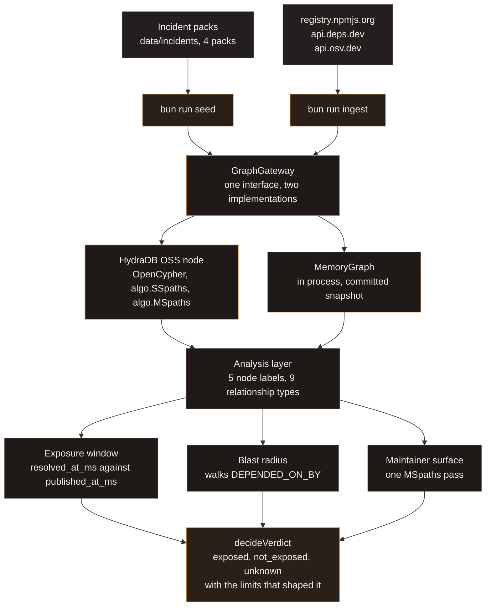

# 🩸 Patient Zero

**Supply chain forensics on a graph that is allowed to say it does not know.**

[](https://github.com/hydra-db/hydradb)
[](https://github.com/hydra-db/hydradb)
[](https://bun.sh)
[](https://nextjs.org)
[](./LICENSE)

A lockfile records what you installed. It does not record whether you installed it
during the hours a package was compromised.

Patient Zero reconstructs that window. It loads real supply chain incidents into a
HydraDB graph, then answers three questions about them: which services resolved a
compromised version while it was live, how far the compromise could travel, and how
much of the registry one stolen publish token reaches. When the graph cannot support an
answer, the answer is `unknown` with the reason attached, never a reassuring blank.

The gap between a malicious publish and the advisory that names it, measured from the
packs in `data/incidents`:

| Incident | First compromised publish | First advisory | Window |
| --- | --- | --- | --- |
| `ua-parser-js` 0.7.29, 0.8.0, 1.0.0 | 2021-10-22 | 2021-10-22 | 8.4 hours |
| `node-ipc` 10.1.1, 10.1.2 | 2022-03-07 | 2022-03-16 | 9.5 days |
| `event-stream` 3.3.6 via `flatmap-stream` | 2018-09-09 | 2018-11-26 | 78.6 days |
| Self-replicating npm worm (modeled) | 2025-11-24 | 2025-11-25 | 13.0 hours |

Every install inside those windows is a resolution nobody flagged at the time. That is
the population this project computes.

## ⚡ Run it

Bun 1.3.14 or newer. Docker only for the live graph path.

**Without Docker.** Everything below runs against the in-process graph and the committed
snapshot, with no services and no network.

```bash
bun install
bun test                                  # analysis, scanner, snapshot and ingest suites
bun run seed                              # writes data/graph/snapshot.json from the 4 incident packs
bun run hydra:measure -- --memory         # one-hop reverse traversal, in process
bun run scan:local -- --path test/fixtures/scanner/compromised --consent
```

`bun run seed -- --incident ua-parser-js-2021` loads a single pack. The slugs are the
filenames in `data/incidents`: `event-stream-2018`, `node-ipc-2022`, `ua-parser-js-2021`,
`self-replicating-worm-2025`.

The scan is the one command with an interesting console, so here it is, with the timing
lines and five of the nine findings cut for length. Point `--path` at any checkout to scan
that one instead.

```text
$ bun run scan:local -- --path test/fixtures/scanner/compromised --consent
[printScanPlan] local persistence scan plan
[printScanPlan]   scan root       compromised
[printScanPlan]   indicators      27 from the catalog
[printScanPlan]   mode            read only, no file is written, moved, deleted, or executed
[printScanPlan]   reported        indicator id, severity, root relative path, line number, title, reason
[printScanPlan]   never reported  file contents, secrets, tokens, absolute paths
[printScanPlan]   consent         given by --consent
[printScanReport]   files visited       7
[printScanReport]   coverage            complete, every eligible file was read
[printScanReport]   findings            9 total, high 9, medium 0, low 0
[printFindings]   2. [high] workflow-dumps-all-secrets at .github/workflows/formatter_88123.yml:12
[printFindings]      what  Workflow serializes the entire secrets context
[printFindings]   3. [high] vscode-task-run-on-folder-open at .vscode/tasks.json:9
[printFindings]      what  VS Code task configured to run when the folder is opened
[printFindings]   4. [high] agent-instruction-credential-read-directive at CLAUDE.md:5
[printFindings]      what  Agent instruction file tells the agent to read credential files
[printFindings]   7. [high] install-hook-pipes-download-to-shell at node_modules/evil-pkg/package.json:6
[printFindings]      what  Install hook pipes a download into a shell
```

Without `--consent` the scan prints that same plan, reads nothing, and exits 1. Consent
is per run, not a stored setting.

**With Docker, against a live HydraDB.**

```bash
cp .env.example .env
openssl rand -hex 32     # put this in HYDRA_AUTH_TOKEN; the node refuses a token under 32 chars
docker compose up --wait
bun run hydra:health     # transport, version, node counts, budgets, readiness
```

Compose starts three services on loopback only: `hydra-init` writes the token into the
shared volume, `graph-node` serves Bolt on 7687, the query API on 8443, and `/readyz` on
9090, and `graph-indexer` runs beside it. `bun run hydra:health -- --bolt` runs the same
checks over the Bolt driver. `bun run ingest` then walks the dependency and advisory
graph outward from the incident packages using three public APIs
(`registry.npmjs.org`, `api.deps.dev`, `api.osv.dev`), caching every response under
`data/harvest`, and writes `data/graph/slice-snapshot.json` with its coverage manifest.
`bun run ingest -- --sink hydra` writes to the live node instead of a file.

Full sequence, every failure mode, and what to do when Docker is not available:
[`docs/RUNNING.md`](./docs/RUNNING.md).

## 🧭 How it works



The graph is small and deliberate: `Package`, `Version`, `Maintainer`, `Service`,
`Advisory`, joined by `VERSION_OF`, `DEPENDS_ON`, `RESOLVES_TO`, `DEPENDED_ON_BY`,
`MAINTAINS`, `RESOLVED`, `AFFECTS`, `AFFECTS_VERSION`, `TYPOSQUAT_OF`. Property names on
the wire are `snake_case` because that is what the engine stores.

Two design decisions carry most of the weight.

**One gateway, two implementations.** `src/lib/graph/gateway.ts` defines the only surface
the analysis layer may touch: nine semantic operations, no raw query pipe. HydraDB accepts
a small Cypher subset (one statement per request, no `IN`, no `min` or `max`), so
multi-step composition has to live in TypeScript anyway. Naming those steps at the
boundary keeps every Cypher string in one file and lets the same analysis code run against
a live node or against an in-process graph. The in-process implementation is not a mock: it
mirrors the engine's edge budget and returns the same truncation reason, so a test that
sees `query_budget_exceeded` is seeing the behaviour the live path produces.

**Reverse edges are measured, not assumed.** "Which versions depend on this compromised
version" is a reverse walk. The ingest materialises `DEPENDED_ON_BY` next to every
`RESOLVES_TO`, and blast radius walks that stored reverse type outgoing. Whether the stored
edge earns its write cost on a given slice is a question with a number attached, so
`bun run hydra:measure` times both patterns on the same data. In live mode it refuses to
fall back to anything: with no reachable node it says the measurement did not run, names
what to start, and exits non-zero. In memory mode every line it prints says the timings are
in-process TypeScript and are not an engine measurement.

## ⚖️ The verdict model

`src/lib/analysis/abstention.ts` is the part worth reading. Three verdicts:

| Verdict | Meaning |
| --- | --- |
| `exposed` | Evidence in the graph places this subject inside the window. |
| `not_exposed` | The traversal completed, over coverage recorded as closed, and found nothing. |
| `unknown` | The graph cannot decide. The reasons come attached. |

The order of the branches is the whole point. `decideVerdict` checks for an empty graph,
then for a subject absent from the slice, then for evidence, then for limits that could
have hidden evidence, and only then may return `not_exposed`, and only when the subject's
closure is recorded as closed in the slice manifest and no limit truncated the walk. An
empty traversal over a partially ingested slice reads `unknown`. There is no path through
that function where a missing ingest renders as safety.

The reasons are typed, not prose: `AnswerLimit` is a ten variant union covering
`empty_graph`, `package_absent`, `package_partial`, `hop_limit`, `path_limit`,
`budget_rejected`, `scan_capped`, `undecidable_versions`, `service_history_partial`, and
`timestamp_missing`. A hop limit is only reported when a path actually reached the ceiling.
A path limit is only reported when the returned count equals the cap. Each one names what
was not seen, which is the difference between an abstention and a shrug.

## 🔬 What it answers

**Exposure window.** Two clocks, kept apart. Valid time is when a service actually resolved
a version, from `RESOLVED.resolved_at_ms` in a lockfile. Known time is when the advisory
naming it was published, from `Advisory.published_at_ms`. The half-open window between them
is pushed down into the traversal rather than filtered after the fact, so the answer is
"these services, at these timestamps", not "these services, probably".

**Blast radius.** From one compromised version outward over the materialised reverse type,
collapsing to one entry per dependent with its shortest route, then enumerating `Service`
nodes and expanding each forward over `RESOLVED`. The service side is walked from the small
end on purpose: `RESOLVED` runs service to version and has no materialised reverse type, so
enumerating the few known services costs fewer requests than one reverse walk per reachable
version. Every cap on that walk is one of the ten limits above.

**Maintainer infection surface.** One stolen publish token reaches every package its owner
can publish to. Hop 1 is measured from `MAINTAINS` edges. Hop 2, what those packages'
dependents would inherit, is a stated worst case and lives behind `isModelled: true` in the
payload rather than being folded into the measured count. Both come back in a single
`algo.MSpaths` pass rather than one request per maintainer.

**Typosquat signals.** Named signals, not a single float: a bounded Damerau-Levenshtein
distance, PEP 503 name normalisation for PyPI so `Flask-Cors` and `flask_cors` compare
correctly, and separate structural checks. The module is pure and IO free, which is why its
behaviour is pinned by tests instead of by a screenshot.

**Local persistence scan.** 27 indicators drawn from published incident writeups, each one
carrying a note on where it came from and saying so in those words when a pattern is a
generalisation of an observed technique rather than a quoted string. It covers install
hooks, GitHub Actions workflows, editor tasks that run on folder open, agent instruction
files, and known payload artifacts. Opt in per run, read only, no file content in the
output, and every pattern bounded so a hostile file cannot turn the scan into a hang.

**Lockfile parsing.** Seven formats across two ecosystems: `npm-lock-v1`, `npm-lock-v2`,
`yarn-classic`, `yarn-berry`, `pnpm`, `requirements-txt`, `poetry-lock`, with a size cap
and a dependency cap that report truncation instead of silently trimming.

## 🗄️ Which HydraDB

There are two unrelated things with this name, and this project uses exactly one of them.

- **Used here:** [`github.com/hydra-db/hydradb`](https://github.com/hydra-db/hydradb),
  crate `slatedb-graph-kernel`, AGPL-3.0. The OSS graph database this hackathon
  open-sources: integer node and relationship ids, a small OpenCypher subset, native path
  procedures, and per-operation budgets that come back as a 429 naming the operation that
  hit them. Pinned to `ghcr.io/hydra-db/hydradb:0.1.1` by digest in
  `docker-compose.yml`.
- **Not used here:** the unrelated `hydradb-sdk` package on PyPI. It shares nothing with
  the above but the name.

HydraDB is AGPL-3.0 and runs as a separate service over its network API. Nothing from the
engine is linked into this codebase, which is Apache-2.0. What the engine does and does not
support, verified against its source rather than assumed, is written up in
[`docs/HYDRADB.md`](./docs/HYDRADB.md), including the corrections where an earlier
assumption turned out to be wrong.

## 🧾 What is verified, and what is not

A security tool that overstates its evidence is worse than one that reports less.

- **Three of the four incident packs are historical, one is modeled.** Every pack carries a
  `dataOrigin` field. `self-replicating-worm-2025` is `modeled`: it is built to the shape of
  the 2025 worm campaign, not harvested from it, and it says so in the data, in the schema
  that validates the data, and here. The other three carry 155 distinct source URLs
  between them.
- **The curated data is small and countable.** 96 compromised versions across 47 packages,
  48 advisories, 30 services with 63 lockfile resolutions, and 71 timeline entries. Those
  are the numbers behind the window table above. The ingested slice is larger and its exact
  size depends on when you run `bun run ingest`, so the manifest it writes records the
  coverage instead of this file claiming a figure.
- **Every answer is a lower bound on the slice, and says so.** The slice manifest marks each
  package `closed`, `partial`, or `absent`, and that mark is what decides whether an empty
  traversal is allowed to read `not_exposed`.
- **Maintainer hop 2 is a stated worst case, flagged `isModelled`** in the answer payload,
  not folded into the measured hop 1 count.
- **The committed curated snapshot holds no version to version dependency edges.**
  `bun run seed` writes `VERSION_OF`, `RESOLVED`, `AFFECTS` and `AFFECTS_VERSION`, which is
  exactly what the bitemporal question needs. Multi-hop dependency blast radius needs
  `RESOLVES_TO` and its materialised reverse, which come from `bun run ingest` or a live
  node.
- **No live engine performance number is published anywhere in this repo.** Docker was not
  available in the environment this was built in, which is why the in-process graph and the
  committed snapshot exist behind the same gateway, and why `hydra:measure` in live mode
  fails loudly rather than printing something plausible.
- **The web interface is still being built.** Today's entry points are the scripts above and
  the test suite. The design system it is being built against is
  [`docs/UI_DESIGN_SYSTEM.md`](./docs/UI_DESIGN_SYSTEM.md), including the rule that
  `exposed`, `unknown`, and `not_exposed` are three visually distinct states so an
  abstention can never be mistaken for a clean result.

## 🗂️ Repository layout

```text
src/lib/graph/       gateway contract, graph model, in-process implementation, snapshots
src/lib/hydra/       HydraDB client: transports, Cypher builders, id map, config
src/lib/analysis/    abstention, bitemporal windows, blast radius, maintainer surface, typosquat
src/lib/ingest/      registry, deps.dev and OSV clients, graph writer
src/lib/incidents/   incident pack schema and validation
src/lib/scanner/     lockfile parsers, persistence indicators
scripts/             health check, traversal measurement, seed, ingest, local scan
data/incidents/      the four incident packs, with sources
data/graph/          committed snapshots and the slice coverage manifest
docs/                engine notes, run book, UI design system
test/                unit and fixture suites for every module above
```

## 📜 License

Apache-2.0, see [`LICENSE`](./LICENSE). HydraDB is AGPL-3.0 and is used as a separate
service over its network API; no engine code is included or linked here.

**Technor** and **Tabular** are trademarks of the Indian Type Foundry. Copyright 2016-2021
Indian Type Foundry. All rights reserved. Both faces are self-hosted under
`src/app/fonts/` and are not covered by the Apache-2.0 license above; their terms are at
[fontshare.com/terms](https://fontshare.com/terms), and
[`src/app/fonts/NOTICE.md`](./src/app/fonts/NOTICE.md) carries the full notice.

Incident facts come from public advisories, registry metadata, and published writeups. The
source URL for each one lives in the pack that states it, in `data/incidents`. Built for
Hack Hydra, Track 02.
